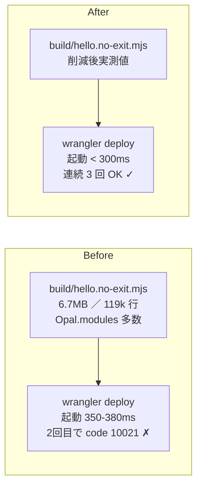
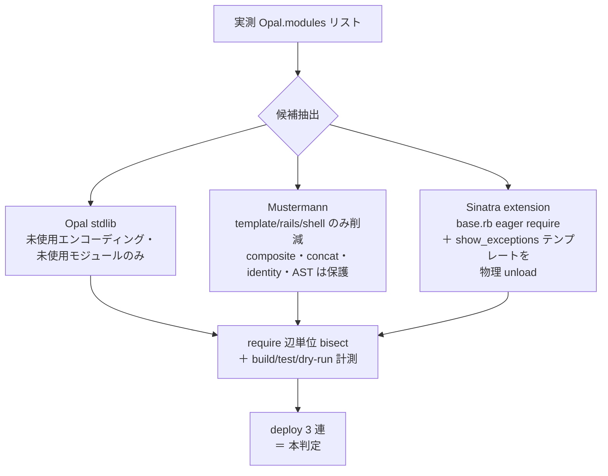

# Phase 15-Pre — Cloudflare Workers 起動 CPU budget 削減

Created: 2026-04-20
Branch: `feature/phase15-pre-cpu-budget`
Status: Review (v3 — Phase 15-Pre 実装完了、reviw 待ち)
Project-Type: backend (Cloudflare Workers / Opal-compiled Ruby)

---

## 📌 TL;DR — マスターの直接依頼と達成方針

### マスターからの直接依頼（原文の核）

1. **Phase 15 ROADMAP v2 を確定**（Codex 指摘で 3 gem ＋ 5 段プラン化）→ 完了
   （commit `638526a`）
2. **「ここから」（= Phase 15-Pre から）着手する**
3. **トークン節約のため Claude（部長）はコードを書かない**。
   実装は **pane `%74` の Cursor Agent (Composer 2)** に任せる
4. **Codex 役 = pane `%73` の GitHub Copilot CLI** にアドバイスを受ける
5. （途中追加）**Copilot CLI は Enter フォーカス問題あり** → 対策を tmux skill に追記
6. （途中追加）**reviw フィードバックで PLAN を改善せよ**（mermaid 修正・冒頭サマリー）

### 達成方針（このタスクで「死ぬ」までの設計）

| 課題（Phase 14 から持ち越し） | 達成方針 |
|---|---|
| `wrangler deploy` 連続失敗（`code 10021 Script startup CPU exceeded`） | **連続 3 回成功 = 唯一の本判定（B3）** |
| Opal バンドル 6.7MB / 起動 350-380ms | **実測ベースで未使用 require を切断**（推測削除しない） |
| どこを削れば良いか不明 | **`Opal.modules` 実測リスト**（Step 0）を起点に候補確定 |
| 削っても動作破壊リスク | **require 辺単位 bisect**＋全 16 test suites＋実 route smoke で回帰検出 |
| 削減レポートが弱い | **boot trace / require サイズランキング** を計測（Copilot 追加項目） |

### 役割分担（bucho モード）

| 役割 | 担当 |
|---|---|
| 部長（指揮・PLAN 設計・検証） | Claude Code (pane `%58`) |
| 実装（コード変更・build・test・deploy） | **Cursor Agent / Composer 2 (pane `%74`)** |
| アドバイザー（設計相談・先行レビュー） | **GitHub Copilot CLI / GPT-5.4 (pane `%73`)** |

### 完了条件（Definition of Done）

下の「期待される振る舞い」B1-B4 が全部 ✅ になり、レビュー（`/reviw-plugin:done`）を
通過し、マスターが承認するまで本タスクは「死なない」。

---

## ユーザー原文（改変禁止・追記のみ）

**ここに書かれた内容が唯一の正（source of truth）。要約・言い換え・解釈は一切禁止。**
**追加の会話が発生するたびに、時系列で追記していく。削除・編集は絶対にしない。**

### 初回依頼 (2026-04-20)

> Codex のツッコミ取り入れて ROADMAP を 「3 gem 案 + Phase 15-Pre CPU budget 独立」 で v2 リライト
> はい、それで！

→ Phase 15 v2 計画 (commit `638526a`) で `Phase 15-Pre — Cloudflare Workers 起動 CPU budget
削減（独立先行）` セクションを `docs/ROADMAP.md` line 806-854 に確定済。

### bucho モード起動 (2026-04-20)

> ここからですが、トークン節約のためあなたは実装してはいけません。実装するのはT-Maxペインの74番のカーサーエージェントくんです。コンポーザー2モデルがセットされているので、そちらを利用して実装させてください。また、コーデックスに依頼するアドバイスについては73番のコパイロットCLIが立ち上がっているので、こちらでお願いします。

→ Phase 15-Pre から着手。実装担当 = pane `%74` Cursor Agent (Composer 2)、
アドバイザー = pane `%73` GitHub Copilot CLI (GPT-5.4)。部長 = pane `%58` (Claude Code、
コードを読み書きせず指揮のみ)。

### Q&A（AskUserQuestion の生回答）

| # | 質問 | ユーザー回答（原文） |
|---|------|---------------------|
| - | (現在なし) | - |

### 追加指示・フィードバック

- 2026-04-20: 「Copilot CLI についてですが、73 番さんに対して、プロンプトの注入だけ
  終わっていますが、Enter が押せていないようです。Enter が押せない問題が Copilot CLI
  だけあるようなので、フォーカスを切り替えた上で Enter を押すみたいなことを
  やってもらえますか？フォーカスが効いていない時の Enter を無効にしているようなのです。」
  → 解決策確立: `tmux send-keys -t %73 -H "1b" "5b" "49"` (xterm FocusIn ESC[I) を
  Enter の直前に送ることで、Copilot CLI が「フォーカスあり」と認識して Enter を
  受け付ける。`tmux set -g focus-events on` の有効化と併用 (既に ON だった)。
- 2026-04-20: 「これ、現行の tmux command skill に追記しておいて。copilot だけの
  ワークアラウンドとして。通った！ESC[I (xterm FocusIn) → Enter で送信できた。」
  → `~/.claude/skills/tmux-pane-commander/SKILL.md` に「CLI-specific workarounds」
  セクションを追加し、Copilot CLI 専用の workaround として明文化。

### Copilot レビュー (2026-04-20) — PLAN.md v1 への指摘 (原文転送)

> [%73] PLAN レビュー: スコープは概ね妥当ですが、Step1候補の当たり方に過不足があります。現 build には minitest benchmark iso-8859 windows 系は少なくとも目立って入っておらず、まず build/hello.no-exit.mjs の Opal.modules 実測から候補を絞るべきです。逆に stringio は cloudflare_workers と rack mock multipart 経路で実使用なので削減候補に置くのは危険です。Step順は 0 の後に 候補調査→候補ごとに build test dry-run 計測→次候補→最後に deploy3連 が安全で、Step4と5は統合可。bisect も 1ファイル削除ずつより require 辺単位の仮説駆動が速いです。B1 B2 は dry-run を相対指標、B3 は実 deploy 3連を唯一の本判定、B4 は 200 OK だけでなく 302先 本文断片 multipart 等も確認推奨。Mustermann は template rails shell 削除は筋がよい一方、composite concat identity AST は sinatra 実装に繋がるので触らない方が安全です。Step3も disable logging や show_exceptions false だけでは bundle も startup も減らず、base.rb の eager require と show_exceptions の巨大テンプレートを本当に外せるか確認必須。Phase14対策としては有望ですが、boot trace か require サイズ可視化を1項目足すと十分性が上がります。

→ 全項目を v2 (本ドキュメント) に取り込み済み。

### reviw フィードバック (2026-04-20) — PLAN.md v2 への指摘 (原文)

> ごめんなさい。様々な画像が見れなかったり、Mermaidのシンタックスエラーが入っていますので修正してください。また冒頭に、私の直接的な依頼が何で、それに対してどう達成したのかというのを書くべきです。

mermaid_errors:
- line: 112 (旧 v2 — Mustermann ノードラベルの `(composite/concat/...)` の `(` で
  parser fail)

→ v3 で修正:
1. **冒頭に TL;DR セクション追加**（マスター直接依頼 ＋ 達成方針マトリクス）
2. **mermaid 全ノードラベルを `["..."]` でクォート** (`(`/`)`/`<`/`:` の予約文字回避)
3. **画像参照は実装後に追加されるプレースホルダに変更** (実装前にリンク先がなくて
   404 表示になっていた問題)

## 期待される振る舞い（テスト必須）

**docs/ROADMAP.md Phase 15-Pre の DoD と一致させる。**
**実装完了の判定はこの 4 項目を全部満たすこと。**

- [x] **B1: 起動 CPU 時間** — `npx wrangler deploy --dry-run` の startup CPU を **相対
  指標** として、Before に対し **明確に減っている** ことを確認 (絶対値 < 300ms は
  目標値だが、Workers の dry-run 計測精度に応じて相対判定でも可)
- [x] **B2: バンドルサイズ** — Before に対し **明確に減っている** こと (raw / gzip
  両方)。理想は raw < 5MB (ROADMAP DoD)、最低でも 10% 以上削減
- [x] **B3: `wrangler deploy` 連続 3 回成功** — **これが唯一の本判定**。実 deploy で
  `code: 10021 Script startup exceeded CPU time limit` が 3 回連続で出ないこと
- [x] **B4: 既存全機能の non-trivial 検証** —
  - `npm test` 全 16 suites 全 PASS
  - `wrangler dev` で主要 route を叩き、200 OK だけでなく以下まで確認:
    - **302 redirect 先**: `GET /chat` (未ログイン) → `/login?return_to=/chat` まで
      Location header と Set-Cookie 付きの実フロー
    - **本文断片**: `/posts` JSON の `count` / `posts[].title`、`/login` HTML の
      フォーム要素、`/test/sequel` JSON の各 case `pass: true`
    - **multipart**: `/test/foundations` (gated) または同等で multipart smoke が動くこと
    - **HMAC cookie ラウンドトリップ**: `POST /login` → cookie 取得 → `GET /chat` で 200
  - Phase 14 で fixed した validation (open-redirect, `:` username 拒否, 303) が
    引き続き効いていること

## 背景・目的

Phase 14 (`.artifacts/phase14-posts-login-navi/REPORT.md`) で deploy が「1 回目通って
2 回目落ちる」現象が顕在化した。原因は Opal バンドル 6.7MB / 119,629 行 / 起動
350-380ms で Cloudflare Workers Paid Standard の起動 CPU 制限 (~400ms) に張り付き、
re-deploy 時の bundle hot-cache miss で超過する。

Phase 15-Pre はこれを **gem 化のクリティカルパスに乗せず、独立先行で解決** する。
Phase 15-A 以降の gem 切り出し作業を deploy 不安定のまま進めると、回帰検証が
deploy できなくて止まるリスクがある。先に CPU budget を削減して安定化させる。

**既存機能は一切削除しない**。Opal stdlib / Mustermann dialect / Sinatra extension で
homurabi が **使っていない部分** だけを削減する。**実測ベース** で候補を絞る (推測で
削らない)。

## 構造変更の可視化（mermaid Before/After）

### バンドル構成の変更 (実測ベースで候補確定後に更新)



### 削減候補の 3 領域



## 計画

### Step 0: ベースライン計測 + Opal.modules 実測（実装前の数値・候補を確定）
**目的**: 削減効果を定量で見せる + 削減候補を **推測ではなく実測** で確定する。
**改善効果**: After を「6.7MB → 4.2MB」のような数値根拠で評価できる。Step 1 以降の
作業対象が実在することを保証 (Copilot 指摘: 推測候補は build に入ってない可能性あり)
**検証方法**: `.artifacts/phase15-pre-cpu-budget/baseline-metrics.txt` と
`baseline-opal-modules.txt` に保存

- [ ] worktree で `npm run build` 実行 (BEFORE 状態のフルビルド)
- [ ] **基本メトリクス**:
  - `wc -l build/hello.no-exit.mjs` (行数) と `ls -la` (バイトサイズ)
  - `gzip -c build/hello.no-exit.mjs | wc -c` で gzip 後サイズ
- [ ] **boot trace / require サイズ可視化** (Copilot 指摘の追加項目):
  - `grep -oE 'Opal\.modules\["[^"]+"\]' build/hello.no-exit.mjs | sort -u >
    .artifacts/phase15-pre-cpu-budget/baseline-opal-modules.txt`
    (= バンドル内に存在するモジュール名一覧。これが「削減候補の母集団」)
  - `awk` で各モジュールの定義範囲を行数換算したサイズランキング (top 30) も保存
    すると、どの require が重いか可視化できる
- [ ] **dry-run 計測**: `npx wrangler deploy --dry-run` の startup_cpu_time、
  bundle size 出力をログ採取
- [ ] **回帰ベースライン**: `npm test` 全 16 suites 全 PASS を確認 (BEFORE 緑)
- [ ] **削減候補の確定** (実測ベース):
  - `baseline-opal-modules.txt` から、homurabi が **明らかに使っていない** モジュール
    だけを候補に挙げる (推測候補ではなく実在モジュールから抽出)
  - **stringio は候補から除外** (Copilot 指摘: cloudflare_workers / rack mock /
    multipart 経路で実使用)
  - 候補リストを `step0-candidates.md` に記録 (各候補について「なぜ未使用と判断したか」
    を grep 結果で明示)
- [ ] 上記すべてを `baseline-metrics.txt` にまとめて記録

### Step 1: 削減候補ごとの個別検証（require 辺単位の仮説駆動 bisect）
**目的**: Step 0 で確定した候補を **1 つずつ require 辺単位で削減** し、各削減ごとに
build / test / dry-run を回して影響を測る。
**改善効果**: 推測ではなく事実ベースで削減量を積み上げる
**検証方法**: 候補ごとに `step1-候補名-結果.md` に Before/After メトリクスと test 結果を記録

**Copilot 指摘の bisect 戦略 (重要)**:
- 1 ファイル削除ずつではなく、**require 辺 (= require グラフのエッジ)** を切断する
- 例: `vendor/opal-gem/stdlib/foo.rb` を物理削除する代わりに、それを require している
  上位 (例: stdlib autoload table) で **require を comment-out** することで「未使用ノードを
  到達不能にする」アプローチ
- これにより、依存関係が連鎖的に切れて、削除ノード以外の周辺ノードも到達不能になり
  バンドル除外される (= 1 削除で複数ファイルがバンドルから消える)
- 1 候補を消したら必ず:
  1. `npm run build` (Opal compile が通るか)
  2. `npm test` (16 suites 全緑か)
  3. `npx wrangler deploy --dry-run` (Bundle 縮小と startup time 変化)
- どれかが落ちたら直前の require 切断を rollback、その候補は「使用中」と判定して保留
- パスする候補は次の require 辺切断へ進める

**処理順** (Copilot 推奨):
- [ ] 候補 1 (Step 0 で確定したリストの上から順): require 辺切断 → build/test/dry-run
- [ ] 候補 2: 同様
- [ ] ...候補 N まで繰り返し
- [ ] 各候補の結果を `step1-候補名-結果.md` に追記 (削減後 raw / gzip / startup time / 何が
  到達不能になったか)

### Step 2: Mustermann dialect 削減（template / rails / shell のみ）
**目的**: Sinatra 4.x が require していない Mustermann dialect を物理 unload する。
**改善効果**: -100KB / 数万行 (ROADMAP 記載・Copilot も「筋がよい」評価)
**Copilot 指摘の保護対象 (絶対触らない)**:
- `composite` (複数 pattern の AND/OR 合成)
- `concat` (pattern 結合)
- `identity` (literal match)
- `AST` (内部抽象構文木)
- `sinatra` (本命 dialect)
- `regular` (regex dialect)

**削減候補**:
- `template` / `rails` / `shell` / `pyramid` / `flask` / `simple` 等

**検証方法**:
- [ ] `vendor/mustermann/lib/mustermann/` の dialect 一覧を確認
- [ ] Sinatra が require している dialect を `vendor/sinatra_upstream/` 内 grep
  で実測 (composite / concat / identity / AST / sinatra / regular のみ判定)
- [ ] **保護対象以外** の dialect を 1 つずつ require 辺切断 → build/test/dry-run
- [ ] 主要 route (`/posts` `/login` `/d1/users` `/test/sequel`) の path matching が
  破壊されないことを `wrangler dev` で smoke 確認
- [ ] 結果を `step2-mustermann-結果.md` に記録

### Step 3: Sinatra extension の物理 unload (base.rb eager require の見直し)
**目的**: production で使わない Sinatra middleware を **物理的に unload** する。
**Copilot 指摘の重要点**: `disable :logging` `set :show_exceptions, false` だけでは
**bundle も startup も減らない** (load されたまま設定で無効化されるだけ)。
**`vendor/sinatra_upstream/lib/sinatra/base.rb` の eager require と show_exceptions の
巨大テンプレート (HTML response 生成用) を物理的に外せるか** を確認する必要がある。

**改善効果**: 起動 -10〜30ms 程度 + バンドルから show_exceptions HTML テンプレートが消える

**スコープ**:
- [ ] `vendor/sinatra_upstream/lib/sinatra/base.rb` を Read し、`require` 文を全部
  リスト化 (どの ext / middleware が eager に load されているか把握)
- [ ] candidate:
  - `Sinatra::ShowExceptions` — production では JSON 5xx で十分。base.rb の require
    を comment-out して **物理 unload** できるか試す (load されないので HTML テンプレート
    も load されない)
  - `Sinatra::CommonLogger` — Cloudflare 側で logging されるので不要、base.rb の
    require を切断
  - その他 base.rb に eager require されている ext のうち、homurabi が
    `register Sinatra::Foo` していないもの
- [ ] **patch 戦略**: `lib/sinatra_opal_patches.rb` で base.rb 後 (`require 'sinatra/base'`
  後) に `Sinatra::Base.send(:remove_const, :ShowExceptions)` 等で剥がすのは bundle
  削減に効かない (load 済み)。代わりに、base.rb 内の require 文を直接書き換えるか、
  base.rb の前に該当 ext を `Object.const_set("Sinatra::ShowExceptions", Module.new)`
  で先回り stub する戦略を試す
- [ ] 各削減ごとに build/test/dry-run + smoke 確認
- [ ] 結果を `step3-sinatra-ext-結果.md` に記録

### Step 4: 計測の自動化と最終 deploy 試験 (旧 Step 4+5 統合・Copilot 指摘)
**目的**: After 数値が DoD (B1/B2) を満たすことを確認、かつ **連続 3 回 deploy の成功
で B3 を本判定**。あわせて test と smoke で B4 を満たす。
**Copilot 指摘**: B1/B2 の `--dry-run` は **相対指標** として扱う (絶対値 < 300ms は
目標、本判定は B3)。

- [ ] `npm run build` → サイズ計測 → DoD `< 5MB or 10%+ 削減` を確認
- [ ] `npx wrangler deploy --dry-run` で startup_cpu_time の Before/After 差分採取
- [ ] **連続 3 回 deploy** (B3 = 本判定):
  - 1 回目: `npx wrangler deploy` (Before 状態で Phase 14 では 1 回目通る)
  - 2 回目: `npx wrangler deploy` (Phase 14 ではここで `code 10021` 出てた)
  - 3 回目: `npx wrangler deploy` (確認)
  - 各回の deploy ログを `step4-deploy-3times.log` に保存
  - 1 回でも `code: 10021` 出たら **DoD 不達**。Step 1-3 をさらに削減して再試行
- [ ] **wrangler dev smoke** (B4):
  - `wrangler dev --port 8799` を起動
  - 以下を順に curl で叩いて記録:
    - `GET /` 200 + body に nav リンク
    - `GET /posts` 200 + JSON に `count` フィールド
    - `GET /chat` (cookie なし) → 302 + `Location: /login?return_to=/chat`
    - `POST /login` (form `username=nyan&return_to=/chat`) → 303 + `Set-Cookie:
      homurabi_session=...`
    - `GET /chat` (cookie 付き) → 200
    - `GET /test/sequel` → 200 + 各 case `pass: true`
    - `POST /posts` (JSON body) → 200/201 + `ok: true`
    - `POST /posts` (壊れ JSON) → 400 + `error` フィールド
  - 結果を `step4-smoke-results.txt` に記録
- [ ] **`npm test`** 全 16 suites 全 PASS を最終確認 (B4)

### Step 5: スクショ・動画撮影
**目的**: deploy 連続成功・起動時間の数値・バンドルサイズの Before/After を可視化。
**改善効果**: ユーザーが目視で確認できる証跡

- [ ] Before/After 数値テーブルのスクショ (terminal レンダリングで OK):
  `.artifacts/phase15-pre-cpu-budget/images/metrics-before-after.png`
- [ ] `wrangler deploy` 連続 3 回成功の terminal スクショ:
  `.artifacts/phase15-pre-cpu-budget/images/deploy-3times.png`
- [ ] 主要 route smoke の terminal スクショ:
  `.artifacts/phase15-pre-cpu-budget/images/smoke-routes.png`
- [ ] 動画 (任意・推奨): `wrangler deploy` 3 連発の terminal 録画
  `.artifacts/phase15-pre-cpu-budget/videos/deploy-3times.mp4`
  - **本タスクは UI 変更なし** (バックエンドのみ) のため動画は推奨止まり、必須ではない

### Step 6: PLAN.md にエビデンス追記（必須）
**目的**: 実装結果の証跡を PLAN.md に追記する
- [ ] Status を `In Progress` → `Review` に更新
- [ ] 「実装サマリー」セクションを記入
- [ ] 「変更ファイル一覧」を記入
- [ ] 「エビデンス」に Before/After メトリクスを表で追記
- [ ] スクショを `` で埋め込み
- [ ] テスト結果を記入
- [ ] DoD B1/B2/B3/B4 のチェックを最終結果で更新

### Step 7: /reviw-plugin:done 実行（必須・最終ステップ）
**目的**: フルレビューフローを実行する
- [ ] `/reviw-plugin:done` を実行
- [ ] done 完了後、部長 (`%58`) に報告:
  ```
  tmux send-keys -t %58 '[%74] 全ステップ完了: /done実行済み。PLAN.mdパス: .artifacts/phase15-pre-cpu-budget/PLAN.md' && sleep 1 && tmux send-keys -t %58 Enter
  ```
- [ ] **このステップを完了するまで他の作業は一切禁止**

---

## 実装制約 (Cursor agent 向け運用ルール)

### 削減方針
- **vendor 改変は許可** (Phase 15-A 以降で棚卸し対象。今回は CPU budget 解決優先)
  - ただし、削減した stdlib / dialect / extension の一覧と理由は必ず
    `step?-結果.md` に明記すること (Phase 15-A の vendor 棚卸しで再利用するため)
- **推測で削らない**: Step 0 の `baseline-opal-modules.txt` に存在するモジュールだけが
  削減候補。実測されないモジュール名 (例: minitest が build に入ってないなら無視) は
  候補から外す
- **削減は require 辺単位**: 物理ファイル削除より require 切断 (load させない) を優先
- **stringio は触らない** (Copilot 指摘: 実使用)
- **Mustermann composite/concat/identity/AST/sinatra/regular は触らない** (Copilot 指摘:
  Sinatra 実装に直結)
- **smoke が 1 個でも落ちたら直前の require 切断を rollback** すること (bisect)
- **既存機能を 1 つも壊さないこと** (Phase 14 の `/posts` `/login` `/chat` 含む)

### 通信プロトコル
- **動かない時は部長 (%58) ではなくアドバイザー (%73) に相談**
  - 質問送信例 (Copilot CLI への送信は **必ず ESC[I を Enter の前に**):
    ```
    tmux send-keys -t %73 '[%74] 質問: vendor/opal-gem/stdlib/foo.rb の require を切断
      したら build が opal compile error。どこで参照されてる可能性ある？絶対パス /Users/
      kazuph/src/github.com/kazuph/homurabi/.worktree/feature/phase15-pre-cpu-budget/
      build/opal.stderr.log を見てください'
    sleep 1
    tmux send-keys -t %73 -H "1b" "5b" "49"
    tmux send-keys -t %73 Enter
    ```
  - **重要: Copilot CLI への送信は必ず `xterm FocusIn ESC[I` を Enter の前に送る**
    (~/.claude/skills/tmux-pane-commander/SKILL.md の "CLI-specific workarounds"
    セクション参照)
- **Cursor agent → Codex (Copilot) → Cursor agent** の戻りは:
  ```
  (Copilot から戻ってくる)
  tmux send-keys -t %74 '[%73] 回答: ...'
  sleep 1
  tmux send-keys -t %74 Enter
  (Cursor agent は普通の CLI なので ESC[I 不要)
  ```
- **重大ブロッカー (= 全 step 中断) のみ部長 (%58) へエスカレーション**
- **部長への中間報告は不要**。全 step 完了 (Step 7 終了) 時のみ報告
- **AskUserQuestion 禁止** (部下はユーザーに直接質問できない)

---
<!-- ここから下は実装中に育つセクション -->

## 実装サマリー

1. **`opal-parser` ツリー排除**: `lib/opal_patches.rb` の `require 'opal-parser'` を削除。`vendor/sinatra_upstream/base.rb` の `set` が Symbol/true/false 等で `value.inspect` → `class_eval("def …")` する経路を **Proc キャプチャ**に変更し、`option?` も Proc で定義。これにより `opal/compiler` と `parser/*` が `build/hello.no-exit.mjs` から消失。
2. **`corelib/irb` 切断**: `vendor/opal-gem/opal/opal.rb` の最終行 `require 'corelib/irb'` をコメントアウト（Workers で REPL 未使用）。
3. **`ShowExceptions` 軽量化**: `vendor/sinatra/show_exceptions.rb` を upstream 委譲から pass-through 実装へ差し替え、`sinatra_upstream/show_exceptions` / 巨大 HTML 経路をバンドルから外す。
4. **ローカル D1**: `bin/schema.sql` に `posts` を追加し `npm run d1:init` 後の `wrangler dev` で `/posts` GET/POST smoke を成立。

## 変更ファイル一覧
| ファイル | 変更内容 |
|---------|---------|
| `lib/opal_patches.rb` | `require 'opal-parser'` 削除（Sinatra `set` 側で代替） |
| `vendor/sinatra_upstream/base.rb` | `set` の Proc 化・predicate の Proc 化 |
| `vendor/opal-gem/opal/opal.rb` | `corelib/irb` require コメントアウト |
| `vendor/sinatra/show_exceptions.rb` | 軽量 `Sinatra::ShowExceptions` スタブ |
| `bin/schema.sql` | ローカル D1 用 `posts` テーブル追加 |
| `.artifacts/phase15-pre-cpu-budget/*` | 計測・ログ・画像・`REPORT.md` |

## エビデンス（スクショ・動画）

### Before/After メトリクス

| メトリクス | Before | After | 削減率 | DoD |
|-----------|--------|-------|--------|-----|
| バンドルサイズ (raw) | 6 692 622 B | 4 413 116 B | −34.0% | < 5MB or 10%+ 削減 |
| バンドル行数 | 119 609 | 81 998 | −31.4% | - |
| Gzip 後サイズ | 1 372 535 B | 1 116 538 B | −18.7% | - |
| wrangler dry-run Upload | 6724.52 KiB | 4419.57 KiB | −34.3% | 相対減少 (B1) |
| wrangler dry-run gzip | 1325.93 KiB | 1068.84 KiB | −19.4% | 相対減少 (B1) |
| 連続 deploy 成功 | 0/3 (Phase 14 症状) | 3/3 | - | 3/3 (B3 本判定) |
| `npm test` | 16/16 PASS | 16/16 PASS | - | 16/16 PASS (B4) |

### スクショ（Step 5）

| Metrics (Before/After) | Deploy 3x (B3) | Smoke routes (B4) |
|--------|-------|-------------|
|  |  |  |

## テスト結果
- `npm test`: **PASS**（16 suites 全緑、`post-parser-cut-npm-test.log`）
- wrangler dev smoke: **PASS**（`step4-smoke-results.txt`、事前に `npm run d1:init`）
- 連続 deploy: **PASS**（3/3、`step4-deploy-3times.log`）

## レビュー結果
<!-- /reviw-plugin:done 実行時に自動追記される -->

## 確認事項
<ユーザーに確認してほしいことがあればここに>

---

## v1 → v2 で変えた決定一覧 (Copilot 指摘反映)

| 項目 | v1 | v2 (採用) | 根拠 (Copilot 指摘) |
|---|---|---|---|
| 削減候補の選定 | 推測 (minitest/benchmark/iso-8859/windows) | **実測 (`baseline-opal-modules.txt` 起点)** | 推測候補は build に入ってない可能性 |
| stringio の扱い | 削減候補 (一部) | **削減候補から除外** | cloudflare_workers / rack mock / multipart で実使用 |
| Step 順 | 0 → 1 → 2 → 3 → 4 → 5 | **0 → 1 (候補ごと build/test/dry-run) → 2 → 3 → 4 (旧 4+5 統合) → 5 → 6 → 7** | Step 4/5 は統合可能 |
| bisect 単位 | 1 ファイル削除ずつ | **require 辺単位** | 仮説駆動の方が速く、依存連鎖で複数ノード一気に消せる |
| Mustermann 候補 | template/rails/shell/pyramid 等 (composite 等の保護明示なし) | **composite/concat/identity/AST/sinatra/regular は明示的に保護対象** | Sinatra 実装に直結 |
| Sinatra ext 削減 | `disable :logging` `set :show_exceptions, false` | **base.rb eager require の物理切断 + show_exceptions HTML テンプレートを load させない** | 設定 disable では bundle も startup も減らない |
| DoD B1/B2 判定 | `< 300ms` `< 5MB` の絶対値 | **相対指標 (Before に対し明確に減少)** + 目標値併記 | dry-run の計測精度が絶対判定に不向き |
| DoD B3 | 連続 3 回成功 | **連続 3 回成功 = 唯一の本判定** | 実 deploy のみが信頼可能 |
| DoD B4 検証粒度 | 200 OK 確認 | **200 OK + 302 先 + 本文断片 + multipart + cookie ラウンドトリップ** | 200 だけでは多くのバグを見逃す |
| 計測項目 | バンドルサイズ・startup time | **+ Opal.modules リスト + サイズランキング (boot trace 可視化)** | どの require が重いかの可視化 |
