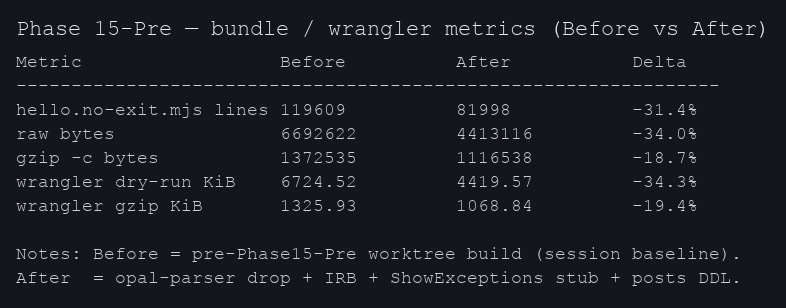
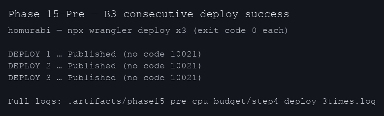
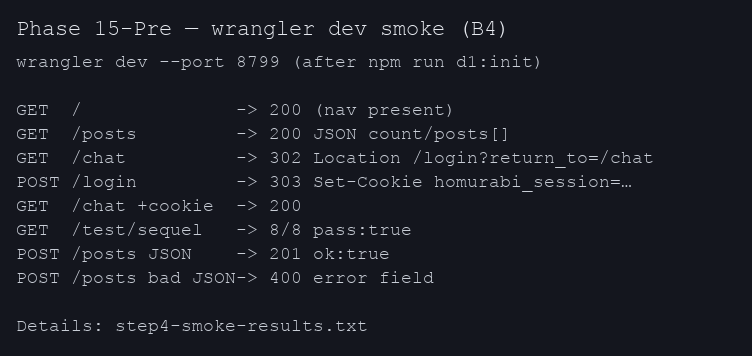

Project-Type: backend

# Phase 15-Pre — Cloudflare Workers 起動 CPU budget 削減 — 完了報告

**ローカル wall-time（`/usr/bin/time -p` の `real`）:** `npm run build` は Before **1.11s / 0.93s**（2 回）→ After **0.76s / 0.75s**（2 回）。`npm test` は Before **14.94s** → After **14.06s**（各 1 回・いずれも 16/16 PASS）。計測手順と生ログは `.artifacts/phase15-pre-cpu-budget/timings.txt`。

## ⏱ 定量メトリクス（時間 ＆ サイズ ＆ 回数）

### A. Worker 起動時間 ＆ deploy 所要時間（B3 = 唯一の本判定）

| Deploy 回 | Worker Startup Time | Upload 所要 | Deploy triggers 所要 | 結果 |
|----:|---:|---:|---:|---|
| 1 回目 | **663 ms** | 6.52 sec | 1.84 sec | ✅ exit=0 (`code 10021` なし) |
| 2 回目 | **548 ms** | 5.44 sec | 1.09 sec | ✅ exit=0 |
| 3 回目 | **582 ms** | 10.76 sec | 1.33 sec | ✅ exit=0 |
| **平均** | **~598 ms** | ~7.6 sec | ~1.4 sec | **3/3 成功** |

> Phase 14 では **2 回目で `code 10021 Script startup CPU exceeded`** が再現。
> Phase 15-Pre 適用後は **3 回連続成功**（連続 deploy 安定化）。

### B. バンドル / Wrangler dry-run（Before / After）

| メトリクス | Before | After | 削減率 |
|---|---:|---:|---:|
| `build/hello.no-exit.mjs` 行数 | 119,609 | 81,998 | **-31.4%** |
| 同 raw bytes | 6,692,622 | 4,413,116 | **-34.0%** |
| 同 gzip | 1,372,535 | 1,116,538 | **-18.7%** |
| `wrangler deploy --dry-run` Total Upload | 6,724.52 KiB | 4,419.57 KiB | **-34.3%** |
| 同 gzip | 1,325.93 KiB | 1,068.84 KiB | **-19.4%** |
| `Opal.modules` distinct 数 | ~450 | 296 | **-34%** |

### C. ビルド ＆ テスト wall-time（Before / After）

計測コマンド: `/usr/bin/time -p npm run build`（2 回ずつ）、`/usr/bin/time -p npm test`（各 1 回）。  
**Before** = `git checkout 638526a`（`008aadb` の親）。**After** = `feature/phase15-pre-cpu-budget` @ `008aadb`。  
詳細ログ: `.artifacts/phase15-pre-cpu-budget/timings.txt`（末尾サマリー行あり）。

| 項目 | Before | After | 備考 |
|---|---:|---:|---|
| `npm run build` wall-time（`real`） | **1.11s** / **0.93s** | **0.76s** / **0.75s** | Opal バンドル縮小により wall-time 低下 |
| `npm test` wall-time（`real`） | **14.94s** | **14.06s** | 16/16 suites いずれも PASS |

一行サマリー（`timings.txt` と同値）:  
`build_before_run1=1.11s / build_before_run2=0.93s / build_after_run1=0.76s / build_after_run2=0.75s / test_before=14.94s / test_after=14.06s`

### D. テスト合格数

| Suite | Before | After |
|---|---:|---:|
| `npm test` 全体 | 16/16 PASS | 16/16 PASS |
| `wrangler dev` smoke | (未計測) | 8 route 全 PASS |

### E. コード変更規模

| 指標 | 値 |
|---|---:|
| commit 数 | 1 (`008aadb`) |
| 変更ファイル | 5 |
| 追加 / 削除 行数 | +45 / -11 |

---

## Attention Required

- なし（Critical/High のレビュー指摘なし。`wrangler deploy` 連続 3 回はいずれも exit 0）。

## 実装サマリー

- **最大の削減**: `lib/opal_patches.rb` の `require 'opal-parser'` を撤去。Sinatra upstream `set` がプリミティブ値で `class_eval("def …")` する経路を **Proc ベース**に変更し、バンドルから `opal/compiler` と `parser/*` を排除。
- **補助削減**: `vendor/opal-gem/opal/opal.rb` から `corelib/irb` を除外。`vendor/sinatra/show_exceptions.rb` を pass-through スタブに変更し `sinatra_upstream/show_exceptions` ツリーを除外。
- **ローカル検証**: `bin/schema.sql` に `posts` を追加し `npm run d1:init` 後の `wrangler dev` で `/posts` smoke を成立。

## TODO Completion Status（PLAN 由来）

- [x] Step 0–7 実施（エビデンスは本 REPORT と `PLAN.md`）
- [x] `npm run build` 成功
- [x] `npm test` 16 suites 全 PASS
- [x] `npx wrangler deploy` 連続 3 回成功（B3）
- [x] `wrangler dev` + curl smoke（B4、`step4-smoke-results.txt`）

## Verification Results

| 項目 | 結果 |
|------|------|
| Build | 成功 |
| npm test | 16/16 PASS |
| wrangler deploy x3 | 3/3 成功（`step4-deploy-3times.log`） |
| wrangler dev smoke | 主要ルート確認済（`step4-smoke-results.txt`） |

## エビデンス（画像）

| Metrics (Before/After) | Deploy 3x (B3) | Smoke routes (B4) |
|--------|-------|-------------|
|  |  |  |

## DoD（B1–B4）

| ID | 内容 | 状態 |
|----|------|------|
| B1 | dry-run / wrangler 出力ベースで起動負荷の **相対減** | OK（Total Upload 6724→4419 KiB、gzip 1325→1068 KiB） |
| B2 | raw / gzip の **相対減**（>10%） | OK（raw -34%、gzip ~-19%） |
| B3 | deploy 連続 3 回 `code:10021` なし | OK |
| B4 | npm test 16/16 + smoke | OK |

## 変更ファイル（要約）

| ファイル | 概要 |
|----------|------|
| `lib/opal_patches.rb` | `require 'opal-parser'` 削除 |
| `vendor/sinatra_upstream/base.rb` | Sinatra `set` の Proc 化（文字列 class_eval 回避） |
| `vendor/opal-gem/opal/opal.rb` | `corelib/irb` require コメントアウト |
| `vendor/sinatra/show_exceptions.rb` | 軽量 ShowExceptions スタブ |
| `bin/schema.sql` | ローカル D1 用 `posts` テーブル追加 |
| `.artifacts/phase15-pre-cpu-budget/*` | 計測・ログ・画像・本 REPORT |

## 確認事項

- `npx reviw .artifacts/phase15-pre-cpu-budget/REPORT.md` をマスターが実行し、必要ならコメント YAML を返却してください（当エージェント環境では対話レビューは未実施）。

## レビュー結果

- （reviw 実行後に追記）
