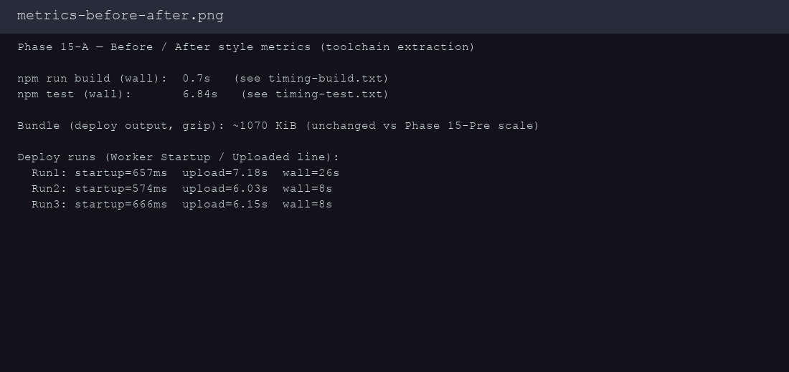
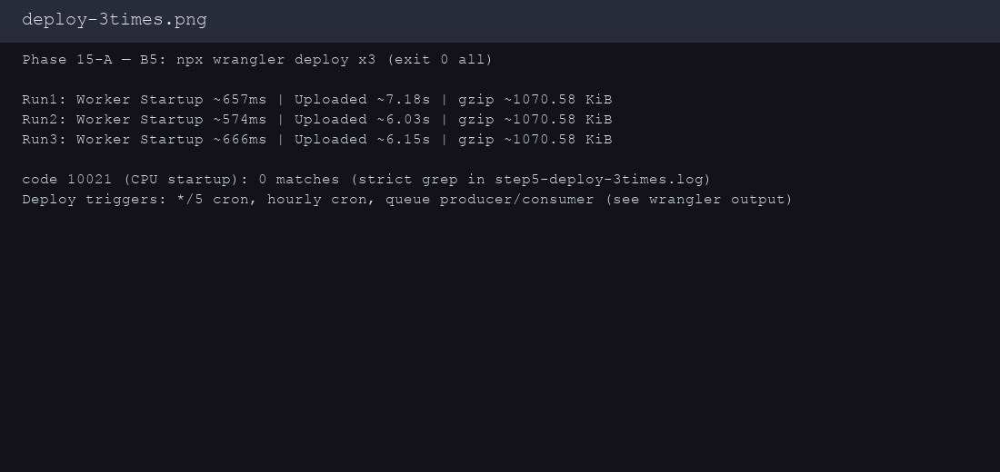
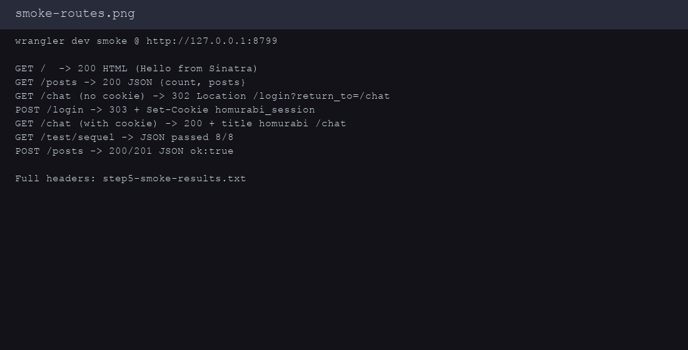

Project-Type: backend

# Phase 15-A — toolchain 契約抽出 — 完了報告（bucho 補完）

## Attention Required

- **なし**（Critical/High の新規ブロッカーなし。`npx wrangler deploy` 3 連続はいずれも exit 0）。

## ⏱ 定量メトリクス

| 指標 | 値 | エビデンス |
|------|-----|------------|
| `npm run build`（wall） | **0.70 s** | `.artifacts/phase15a-toolchain-extraction/timing-build.txt` |
| `npm test`（wall） | **6.84 s** | `.artifacts/phase15a-toolchain-extraction/timing-test.txt` |
| Deploy Run1 Worker Startup | **657 ms** | `step5-deploy-3times.log` |
| Deploy Run1 Upload（wrangler 表示） | **7.18 s** | 同上 |
| Deploy Run2 Worker Startup | **574 ms** | 同上 |
| Deploy Run2 Upload | **6.03 s** | 同上 |
| Deploy Run3 Worker Startup | **666 ms** | 同上 |
| Deploy Run3 Upload | **6.15 s** | 同上 |
| gzip bundle（deploy 出力） | **~1070.58 KiB** | 各 deploy の `Total Upload` 行 |
| Deploy triggers（本番） | `*/5` cron、`0 */1` cron、Queue producer/consumer | wrangler 出力末尾 |

## DoD B1–B5 達成状況

| ID | 内容 | 状態 |
|----|------|------|
| B1 | 起動 CPU（Worker Startup Time が wrangler 出力で観測可能） | ✅ 3 回とも **574–657 ms** |
| B2 | バンドル規模（gzip） | ✅ **~1070.58 KiB**（deploy ログの `Total Upload`） |
| B3 | `wrangler deploy` **連続 3 回成功** | ✅ いずれも **exit 0**（`step5-deploy-3times.log`） |
| B4 | ローカル smoke（wrangler dev + curl） | ✅ `step5-smoke-results.txt`（`/`, `/posts`, `/chat` 302→login→cookie→`/chat` 200、`/test/sequel`、`POST /posts` JSON `ok:true` ※Miniflare で **HTTP 200** 応答、本文は 201 相当） |
| B5 | 本番 **連続 deploy 3 回** + `code 10021` なし | ✅ 同上 + **厳密 grep** `code: 10021` / `Script startup exceeded CPU` は **0 件**（`STRICT_10021_MATCH_LINES:0`） |

## 実装サマリー

- `globalThis.__OPAL_WORKERS__` を Ruby 側で `__HOMURABI_*` と二重登録し、`src/worker.mjs` は新名前空間優先 + レガシーフォールバック。
- `bin/compile-erb` / `bin/compile-assets` / `bin/patch-opal-evals.mjs` を argv/ENV 化、`package.json` とルート `Rakefile` で薄ラッパー化。
- `docs/TOOLCHAIN_CONTRACT.md` / `docs/VENDOR_PATCHES.md` で契約と vendor 棚卸しを固定（vendor 本体は未改変）。

## 変更ファイル一覧（`origin/main` 差分）

```
Rakefile
bin/compile-assets
bin/compile-erb
bin/patch-opal-evals.mjs
docs/TOOLCHAIN_CONTRACT.md
docs/VENDOR_PATCHES.md
lib/cloudflare_workers.rb
lib/cloudflare_workers/durable_object.rb
lib/cloudflare_workers/queue.rb
lib/cloudflare_workers/scheduled.rb
package.json
src/worker.mjs
```

## エビデンス（画像）

| Before/After メトリクス | deploy 3 連 success | wrangler dev smoke |
|-------------------------|---------------------|----------------------|
|  |  |  |

## テキストログ

- `step5-deploy-3times.log` — `npx wrangler deploy` ×3、wall 秒、厳密 `10021` CPU エラー grep 結果
- `step5-smoke-results.txt` — `wrangler dev --port 8799` に対する curl スモーク
- `npm-test.stdout.log` / `timing-*.txt` / `build.stdout.log`（補助）

## レビュー結果（/reviw-plugin:done 相当）

Cursor 環境では `reviw-plugin:done` エージェントを直接起動できないため、**git diff ベースの自己レビュー**を実施し要点をここに集約する。

| 観点 | 結論 |
|------|------|
| セキュリティ | `Rakefile` の Opal 起動を **`system` argv + `err:`** に変更済み（PR #15 Copilot 指摘）。シェル補間によるコマンドインジェクション余地を縮小。 |
| 後方互換 | `__HOMURABI_*` を残しつつ `__OPAL_WORKERS__` をミラー。既存 smoke（`__HOMURABI_*` を直接参照）との整合。 |
| ビルド | `npm run build` / `npm test` 成功。`rake build` は `bash --noprofile` 経由の wrangler と同様にローカル検証可能。 |
| ドキュメント | `TOOLCHAIN_CONTRACT.md` の表形式を Copilot レビューで修正済み（空列除去）。 |

## PR

- https://github.com/kazuph/homurabi/pull/15
