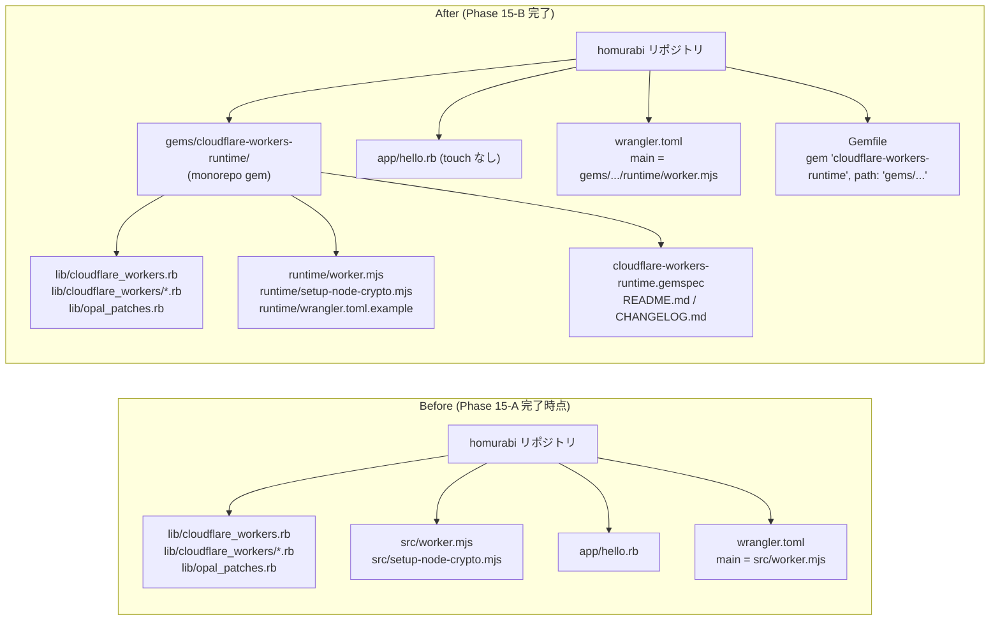
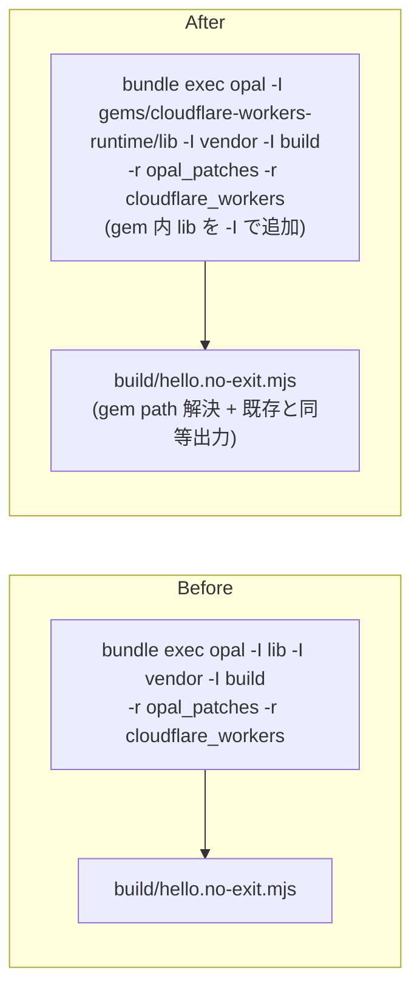

# Phase 15-B — `cloudflare-workers-runtime` gem 切り出し（コア層）

Created: 2026-04-20
Branch: `feature/phase15b-cfw-runtime-gem`
Status: Review（Step 8–9 検証・証跡まで完了 → Step 10–11 PR / Copilot）
Project-Type: backend (Cloudflare Workers / Opal-compiled Ruby) + gem packaging

### 進捗サマリー（簡潔版・2026-04-20）

- Step 0–7: gem 切り出し・配線・README 完了（`git mv` 履歴温存、`path:` 依存、`-I` / `wrangler.toml` `main` 更新）。
- Step 8: `mise exec -- npm test` 16/16 相当チェーン PASS、`d1:init` 後 `wrangler dev :8799` で主要 route スモーク OK、`wrangler deploy` 連続 3 回 exit=0・`10021` 0 件、本番 `/posts` 200。
- Step 9: `.artifacts/phase15b-cfw-runtime-gem/REPORT.md` + 画像 3 枚 + 各種 `.log`/`.txt` 保存済み。
- Step 10–11: PR 作成・Copilot 対応・部長 `%58` 報告（Cursor 実行中）。

---

## 📌 TL;DR — マスターの直接依頼と達成方針

### マスターからの直接依頼（原文の核）

1. **PR #15 (Phase 15-A) マージ済 → 続きの Phase 15-B やってね**
2. **計画チェック不要、PR 作成 + Copilot コメント対応まで一気通貫** (Phase 15-A 時の指示が継続適用)
3. **トークン節約のため部長 (Claude) はコードを書かず、実装は Cursor Agent (Composer 2 / `%74`)、アドバイザーは GitHub Copilot CLI (GPT-5.4 / `%73`)**

### 達成方針 (このタスクで「死ぬ」までの設計)

| 課題 | 達成方針 |
|---|---|
| `lib/cloudflare_workers.rb` (783 行) + 周辺が homurabi 専用ディレクトリ構造に置かれてる | **monorepo 内に `gems/cloudflare-workers-runtime/`** を作成、コアファイル群を移動 |
| 他の Ruby アプリから利用できない | **`cloudflare-workers-runtime.gemspec`** を作成、homurabi 自身が `path:` 依存で参照 |
| 既存全機能が壊れる懸念 | **既存全 16 test suites + wrangler dev smoke + wrangler deploy 連続 3 回成功** で回帰検証 |
| Opal の require 解決と Bundler の require 解決の二重戦略 | **Opal の `-I` flag で gem の lib path を明示** (Rakefile or package.json) |
| `runtime/worker.mjs` が wrangler の build 解決で見つからない可能性 | **wrangler.toml の `main =`** が gem 内 path を resolveできるか実機確認、駄目なら symlink/copy で対処 |

### 役割分担 (bucho モード)

| 役割 | 担当 |
|---|---|
| 部長 (指揮・PLAN・検証) | Claude Code (`%58`) |
| 実装 (gem 切り出し・移動・回帰・PR・Copilot 対応) | **Cursor Agent / Composer 2 (`%74`)** |
| アドバイザー (gem packaging 設計相談) | **GitHub Copilot CLI / GPT-5.4 (`%73`)** |

### 完了条件 (DoD)

下の「期待される振る舞い」B1-B7 が全部 ✅ になり、PR 作成 + Copilot レビュー対応まで完了するまで本タスクは「死なない」。

---

## ユーザー原文（改変禁止・追記のみ）

### 初回依頼 (2026-04-20)

> はい、マージ！続きをどうぞ。

(PR #15 = Phase 15-A マージ後、続きの Phase 15-B を bucho モード継続で着手する指示)

### Phase 15-Pre / 15-A から持ち越しの bucho 運用ルール (継続適用)

> ここからですが、トークン節約のためあなたは実装してはいけません。実装するのはT-Maxペインの74番のカーサーエージェントくんです。コンポーザー2モデルがセットされているので、そちらを利用して実装させてください。また、コーデックスに依頼するアドバイスについては73番のコパイロットCLIが立ち上がっているので、こちらでお願いします。

> 計画チェック不要です。PR作成とcopilotコメント対応まで一気通貫でよろしくです。

### Q&A（AskUserQuestion の生回答）

| # | 質問 | ユーザー回答（原文） |
|---|------|---------------------|
| - | (現在なし) | - |

### 追加指示・フィードバック

- (現時点なし)

---

## 期待される振る舞い (テスト必須)

**docs/ROADMAP.md Phase 15-B の DoD と一致させる。**

- [x] **B1**: monorepo 内に `gems/cloudflare-workers-runtime/` ディレクトリが作成され、以下を含む:
  - `cloudflare-workers-runtime.gemspec` (gem metadata)
  - `lib/cloudflare_workers.rb` (旧 `lib/cloudflare_workers.rb` 移動)
  - `lib/cloudflare_workers/{d1,kv,r2,ai,queue,durable_object,cache,http,scheduled,multipart,stream}.rb` (旧 `lib/cloudflare_workers/*.rb` 全移動)
  - `lib/opal_patches.rb` (旧 `lib/opal_patches.rb` 移動)
  - `runtime/worker.mjs` (旧 `src/worker.mjs` 移動)
  - `runtime/setup-node-crypto.mjs` (旧 `src/setup-node-crypto.mjs` 移動)
  - `runtime/wrangler.toml.example` (新規、gem ユーザー向けテンプレート)
  - `README.md` + `CHANGELOG.md`
- [x] **B2**: homurabi の `Gemfile` に `gem 'cloudflare-workers-runtime', path: 'gems/cloudflare-workers-runtime'` を追加し、`bundle install` で resolve できる
- [x] **B3**: 既存の `lib/cloudflare_workers*` `lib/opal_patches.rb` `src/worker.mjs` `src/setup-node-crypto.mjs` が **削除されている** (gem に移動済)
- [x] **B4**: `wrangler.toml` の `main =` を gem 内 worker.mjs path に変更 (例: `main = "gems/cloudflare-workers-runtime/runtime/worker.mjs"`) → wrangler が build できる
- [x] **B5**: Opal compile で gem 内 lib も resolve される (Rakefile/package.json で `-I gems/cloudflare-workers-runtime/lib` 追加)
- [x] **B6**: 既存全機能の non-trivial 検証
  - `npm test` 全 16 suites 全 PASS
  - `wrangler dev` で主要 route smoke (Phase 15-Pre/15-A 同パターン: `/`, `/posts`, `/chat→/login→cookie→/chat`, `/test/sequel`, `POST /posts` JSON)
  - `npx wrangler deploy` 連続 3 回成功 (`code 10021` 0 件)
- [x] **B7**: gem の対外 API ドキュメント (`gems/cloudflare-workers-runtime/README.md`) に以下が明記
  - Ruby 側 API: `Cloudflare::{D1Database, KV, R2, AI, Queue, HTTP, DurableObject}` + `CloudflareWorkers.register_*`
  - JS 側 contract: `globalThis.__OPAL_WORKERS__.{rack, scheduled, queue, do}.*`
  - 「Sinatra 使うなら Phase 15-C `sinatra-cloudflare-workers` も入れて」誘導
  - 最小サンプル (Sinatra なし、Rack だけ)

## 背景・目的

Phase 15-A で toolchain 契約が抽出された (`__OPAL_WORKERS__` namespace + build CLI argv + TOOLCHAIN_CONTRACT.md + VENDOR_PATCHES.md)。**次は実際にコア層を gem として切り出す**。

`cloudflare-workers-runtime` は Sinatra も Sequel も知らない最小コア:
- Cloudflare bindings ラッパ (D1/KV/R2/AI/Queue/DO/Cache/HTTP)
- Opal/Workers ランタイム patch
- JS bridge (`worker.mjs`)
- Rack adapter (Sinatra 等の上位フレームワークを乗せる土台)

これを切り出すことで:
- **Phase 15-C** で `sinatra-cloudflare-workers` gem がこれに依存して切り出せる
- **Phase 15-D** で `sequel-d1` gem も依存できる
- 他の Ruby ユーザーが「Sinatra 使わず Rack だけで edge 動かしたい」ニーズに応えられる

**hello.rb 分割は Phase 15-C へ** (sinatra-cfw gem 切り出しとセット)。本 Phase ではアプリコードに触らない。

## 構造変更の可視化 (mermaid Before/After)

### ファイル配置 Before/After



### Opal compile path 解決 Before/After



---

## 計画

### Step 0: ベースライン記録 + 移動対象ファイル確定
**目的**: After との比較材料、移動先確定 (1 つも漏らさない)
**改善効果**: Cursor が迷わず移動 + 削除できる

- [ ] worktree で `npm run build` 成功確認 (BEFORE 緑)
- [ ] `npm test` 16/16 PASS 確認 (BEFORE 緑) → `baseline-npm-test.log`
- [ ] `wrangler deploy --dry-run` で baseline upload 数値採取 → `baseline-wrangler-dry-run.log`
- [ ] 移動対象ファイル一覧を `step0-files-to-move.md` に記録:
  - `lib/cloudflare_workers.rb` → `gems/cloudflare-workers-runtime/lib/cloudflare_workers.rb`
  - `lib/cloudflare_workers/*.rb` → `gems/cloudflare-workers-runtime/lib/cloudflare_workers/*.rb`
  - `lib/opal_patches.rb` → `gems/cloudflare-workers-runtime/lib/opal_patches.rb`
  - `src/worker.mjs` → `gems/cloudflare-workers-runtime/runtime/worker.mjs`
  - `src/setup-node-crypto.mjs` → `gems/cloudflare-workers-runtime/runtime/setup-node-crypto.mjs`
- [ ] homurabi 側で残置するもの (lib/sinatra_*, lib/sequel_*, lib/sinatra/, lib/sequel/, lib/homurabi_markdown.rb 等) の一覧確認

### Step 1: gem ディレクトリ構造 + gemspec 作成
**目的**: 受け皿を先に作る (移動前の空 gem 構造)

- [ ] `gems/cloudflare-workers-runtime/` 作成
  - `gems/cloudflare-workers-runtime/lib/cloudflare_workers/` (空ディレクトリ)
  - `gems/cloudflare-workers-runtime/runtime/` (空ディレクトリ)
- [ ] `gems/cloudflare-workers-runtime/cloudflare-workers-runtime.gemspec` 作成
  - name: `cloudflare-workers-runtime`
  - version: `0.1.0` (semver 0.x、開発中)
  - summary: `Cloudflare Workers runtime for Opal-compiled Ruby (D1/KV/R2/AI/Queue/DO/Cache/HTTP wrappers + JS bridge)`
  - authors: `Kazuhiro Homma`
  - license: 適切なものを選択 (homurabi にあれば踏襲、なければ `MIT` で OK)
  - files: `lib/**/*` `runtime/**/*` `README.md` `CHANGELOG.md`
  - require_paths: `["lib"]`
  - dependencies: なし (pure Opal-compatible Ruby)
- [ ] `gems/cloudflare-workers-runtime/README.md` skeleton (Step 7 で詳細化)
- [ ] `gems/cloudflare-workers-runtime/CHANGELOG.md` skeleton (`## 0.1.0 - 2026-04-20`)

### Step 2: ファイル移動 (`git mv` で履歴温存)
**目的**: 履歴を温存して移動 (Cursor は git mv を使うこと)
**改善効果**: blame で過去の変更履歴が追える

- [ ] `git mv lib/cloudflare_workers.rb gems/cloudflare-workers-runtime/lib/cloudflare_workers.rb`
- [ ] `git mv lib/cloudflare_workers/ gems/cloudflare-workers-runtime/lib/cloudflare_workers/` (ディレクトリ全体)
- [ ] `git mv lib/opal_patches.rb gems/cloudflare-workers-runtime/lib/opal_patches.rb`
- [ ] `git mv src/worker.mjs gems/cloudflare-workers-runtime/runtime/worker.mjs`
- [ ] `git mv src/setup-node-crypto.mjs gems/cloudflare-workers-runtime/runtime/setup-node-crypto.mjs`
- [ ] (もし `src/` が空になったら削除しても OK だが、判断は Cursor に任せる)

### Step 3: Gemfile 更新 + Bundler resolve
**目的**: homurabi 自身が新 gem を path 依存で参照

- [ ] homurabi の `Gemfile` に追記: `gem 'cloudflare-workers-runtime', path: 'gems/cloudflare-workers-runtime'`
- [ ] `bundle install` で resolve できることを確認
- [ ] `Gemfile.lock` の更新を含める

### Step 4: Opal compile path 解決
**目的**: gem 内 lib を Opal が見つけられるようにする

- [ ] `Rakefile` の `build:opal` task (Phase 15-A で作った `Rakefile` を編集) で `-I gems/cloudflare-workers-runtime/lib` を `-I` リストに追加
- [ ] `package.json` の `build:opal` も同様に更新 (もし Rakefile 経由ならそのまま、直 opal コマンドの場合は `-I` 追加)
- [ ] `npm run build` 成功確認 (After 1 回目)

### Step 5: wrangler.toml の `main =` 更新
**目的**: wrangler が gem 内 worker.mjs を bundle できるようにする

- [ ] `wrangler.toml` の `main = "src/worker.mjs"` を `main = "gems/cloudflare-workers-runtime/runtime/worker.mjs"` に変更
- [ ] `npx wrangler deploy --dry-run` で bundle 成功確認

### Step 6: 既存 require の追従確認 (cleanup 削除)
**目的**: 旧 path への参照が残ってないこと
**Cursor は grep で念入りに探索**

- [ ] `grep -rn "require ['\"]cloudflare_workers" app/ test/ lib/ vendor/` で参照箇所列挙
- [ ] `grep -rn "require ['\"]opal_patches" app/ test/ lib/ vendor/` 同様
- [ ] 移動後も `require 'cloudflare_workers'` / `require 'opal_patches'` で動くこと確認 (Bundler が gem の lib path を $LOAD_PATH に追加するため、本来は無修正で動く)
- [ ] `src/worker.mjs` を import してる箇所がないか確認 (普通は wrangler.toml 経由のみ)

### Step 7: gem README.md 詳細化 (B7 達成)
**目的**: 他 Ruby ユーザー向け interface 仕様書

- [ ] `gems/cloudflare-workers-runtime/README.md` を以下構成で書く:
  - **タイトル + 1 行サマリー**
  - **Quick Start** (3-5 行サンプル: Sinatra なし、Rack だけ)
  - **Ruby API**: `Cloudflare::{D1Database, KV, R2, AI, Queue, HTTP, DurableObject, Cache}` の主要メソッド一覧
  - **Hooks**: `CloudflareWorkers.register_rack(app)` `register_scheduled` `register_queue` の usage
  - **JS Contract**: `globalThis.__OPAL_WORKERS__.{rack, scheduled, queue, do}.*` の signature
  - **wrangler.toml minimal example** (`runtime/wrangler.toml.example` への link)
  - **Use with Sinatra**: 「Sinatra 使うなら Phase 15-C `sinatra-cloudflare-workers` も入れて」誘導 (Phase 15-C は未公開だが「Coming soon」として記載 OK)
  - **Build pipeline**: Opal compile flags の必要分 + `-I gems/cloudflare-workers-runtime/lib` の解説

### Step 8: 回帰検証 (B6 達成)
- [ ] `npm test` 16/16 全 PASS → `final-npm-test.log`
- [ ] `wrangler dev --port 8799` で主要 route smoke (Phase 15-A 同パターン: `/`, `/posts`, `/chat`→`/login`→cookie→`/chat`, `/test/sequel`, `POST /posts`) → `step8-smoke-results.txt`
- [ ] `npx wrangler deploy` 連続 3 回成功 → `step8-deploy-3times.log`
  - 各回 `code: 10021` 0 件
  - 各回 exit=0
- [ ] live verify 1-2 件 (`https://homurabi.kazu-san.workers.dev/posts` 200 等)

### Step 9: スクショ + REPORT.md 作成
**目的**: PR レビュアー & マスター向けエビデンス

- [ ] スクショ 3 枚 (Phase 15-Pre/15-A 同パターン、terminal レンダリング):
  - `images/structure-before-after.png` — ファイル配置の Before/After (text 表 OK)
  - `images/deploy-3times.png` — deploy 3 連 success
  - `images/smoke-routes.png` — wrangler dev smoke 結果
- [ ] `.artifacts/phase15b-cfw-runtime-gem/REPORT.md` 作成 (Phase 15-A REPORT 同形式):
  - 冒頭 ⏱ 定量メトリクス (build/test wall-time, deploy x3 Worker Startup Time / Upload, gem 内ファイル数 vs 旧位置)
  - DoD B1-B7 達成状況表
  - 実装サマリー (gem ディレクトリ構造、git mv による履歴温存、Opal -I flag 追加、wrangler.toml main 更新)
  - 変更ファイル一覧 (移動 + 新規)
  - エビデンス画像 markdown 埋め込み
  - レビュー結果 (Cursor 環境で /done 起動できなければ git diff 自己レビュー)

### Step 10: PLAN.md 簡潔版に更新 + 部長 (`%58`) に中間報告
- [ ] PLAN.md の Status を `Review` に
- [ ] 中間報告:
  ```
  tmux send-keys -t %58 '[%74] Step 0-9 完了, 実装 commit 済み, Step 11 PR/Copilot 開始' && sleep 1 && tmux send-keys -t %58 Enter
  ```

### Step 11: 一気通貫 PR 作成 + Copilot コメント対応 (本 Phase の肝)
**目的**: ユーザー指示「PR 作成 + Copilot コメント対応まで一気通貫」

- [ ] `.artifacts/phase15b-cfw-runtime-gem/{REPORT.md,PLAN.md,baseline-*.{txt,log,md},step?-*.{md,txt,log},images/*.png}` を `git add -f`
- [ ] commit 例 (3 commit 構成推奨):
  - `feat(gem): extract cloudflare-workers-runtime gem (move lib/ + src/ to gems/)` — git mv による移動 + gemspec
  - `chore: wire homurabi to use cloudflare-workers-runtime via path:` — Gemfile, wrangler.toml main, Rakefile -I 追加
  - `docs(phase15b): REPORT/PLAN/B1-B7 evidence` — 証跡
- [ ] `git push -u origin feature/phase15b-cfw-runtime-gem`
- [ ] `gh pr create --base main --title "Phase 15-B: extract cloudflare-workers-runtime gem (monorepo path: dependency)" --body "<本 PLAN の TL;DR + B1-B7 結果テーブル + メトリクス + エビデンス画像参照>"`
- [ ] PR 番号控える (例: PR #16)
- [ ] **Copilot レビュー待ち** (PR 作成から 5-10 分以内)
  - 1 分おき polling (最大 15 分)
  - 来なければ「Copilot review 来ず、待機継続」を部長に中間報告
- [ ] **Copilot review 着 → 全件対応**:
  - 修正必要なら: コード修正 → `git add` → `git commit -m "fix(pr<N>): address Copilot review (<件数> comments)"` → `git push origin HEAD`
  - 各 inline comment に reply: `gh api -X POST repos/kazuph/homurabi/pulls/<N>/comments/<id>/replies -f body="対応しました (commit <hash>)。<具体内容>"`
  - 全件 reply 完了後、PR サマリーコメント: `gh pr comment <N> --body "@copilot レビュー <件数> 件、commit <hash> で対応しました。..."`
- [ ] 追加レビュー来るか 60 秒待機、来なければ完了
- [ ] 部長 (`%58`) に **最終報告**:
  ```
  tmux send-keys -t %58 '[%74] Phase 15-B 全ステップ完了: PR #<N> 作成 + Copilot review <件数> 件対応済み, push 完了' && sleep 1 && tmux send-keys -t %58 Enter
  ```
- [ ] **このステップを完了するまで他の作業は一切禁止**

---

## 実装制約 (Cursor agent 向け運用ルール)

### gem 切り出し方針
- **`git mv` を使う** (履歴温存)。`cp + rm` は禁止
- **既存ファイルの中身は触らない** (gem 切り出しは「移動」のみ。Phase 15-Pre / 15-A の変更は維持)
- **vendor/ には一切触らない** (Phase 15-Pre/15-A 同様、gem スコープ外)
- **app/hello.rb には一切触らない** (Phase 15-C で分割するスコープ)
- **lib/sinatra_* lib/sequel_* lib/sinatra/ lib/sequel/ lib/homurabi_markdown.rb は homurabi 側に残す** (Phase 15-C/15-D で別 gem 切り出し)
- **gem 名 / クラス名は ROADMAP に従う**: `cloudflare-workers-runtime` / `Cloudflare::*` / `CloudflareWorkers.register_*`

### 通信プロトコル
- **詰まったら部長 (%58) ではなくアドバイザー (%73 = Copilot CLI) に相談**
  - Copilot CLI への送信は **必ず ESC[I を Enter の前に**:
    ```
    tmux send-keys -t %73 '[%74] 質問: ...'
    sleep 1
    tmux send-keys -t %73 -H "1b" "5b" "49"
    tmux send-keys -t %73 Enter
    ```
- **重大ブロッカー (= 全 step 中断) のみ部長 (%58) へエスカレーション**
- **部長への中間報告は Step 10 (実装完了) と Step 11 (PR + Copilot 対応完了) の 2 回のみ**
- **AskUserQuestion 禁止** (部下はユーザーに直接質問できない)

### bucho プロトコル準拠 (Phase 15-A の学びを反映)
- **連続 deploy 3 回成功** (Step 8) は **本 Phase の本判定**。1 回でも `code 10021` 出たら DoD 不達、追加削減 or 設定見直し必要
- **REPORT.md 冒頭に定量メトリクス必須** (Phase 15-Pre/15-A の継続。マスター指示)
- **スクショ 3 枚必須** (Step 9)
- **`/reviw-plugin:done` 実行**: Cursor 環境で skill 直接起動できなければ git diff ベース自己レビューで代替し、REPORT に明記 (Phase 15-A 同様)
- **PR レビュアーが追える PR body**: TL;DR + B1-B7 結果 + Before/After + エビデンス画像 link

---
<!-- ここから下は実装中に育つセクション -->

## 実装サマリー

`cloudflare-workers-runtime` を monorepo 内 `gems/` に切り出し、homurabi は `path:` 依存と Opal `-I` と `wrangler.toml` の `main` で参照。検証は `mise exec` 前提（Bundler 2.6.9）。ローカル dev スモーク前に `npm run d1:init` が必要。詳細は `REPORT.md`。

## 変更ファイル一覧
| ファイル | 変更内容 |
|---------|---------|
| (実装後追記) | (実装後追記) |

## エビデンス（スクショ）

### Before/After メトリクス

| メトリクス | Before | After | DoD |
|-----------|--------|-------|-----|
| `gems/cloudflare-workers-runtime/` 存在 | なし | あり | B1 |
| `gems/cloudflare-workers-runtime/lib/*.rb` ファイル数 | 0 | (Step 1-2 後) | B1 |
| `lib/cloudflare_workers*` 存在 | あり | なし (gem に移動) | B3 |
| `src/worker.mjs` 存在 | あり | なし (gem に移動) | B3 |
| Gemfile に `cloudflare-workers-runtime` | なし | あり | B2 |
| `wrangler.toml` main path | `src/worker.mjs` | `gems/.../runtime/worker.mjs` | B4 |
| `npm test` | 16/16 PASS | 16/16 PASS | B6 |
| `wrangler deploy` 連続 3 回 | (Phase 15-A 達成) | 3/3 | B6 |
| `npm run build` wall-time | (Step 0 計測) | (Step 8 計測) | 参考 |

### スクショ (実装後追加)

予定:
- `./images/structure-before-after.png`
- `./images/deploy-3times.png`
- `./images/smoke-routes.png`

## テスト結果
- `npm test`: PASS/FAIL (件数)
- wrangler dev smoke: route 別 PASS/FAIL
- 連続 deploy: PASS/FAIL (回数)

## レビュー結果
<!-- /reviw-plugin:done 相当の git diff 自己レビュー結果 + PR Copilot レビュー後に追記 -->

## PR 情報
- PR 番号: (実装後追記)
- URL: (実装後追記)
- Copilot review 件数: (実装後追記)
- 対応 commit hashes: (実装後追記)

## 確認事項
<ユーザーに確認してほしいことがあればここに>
