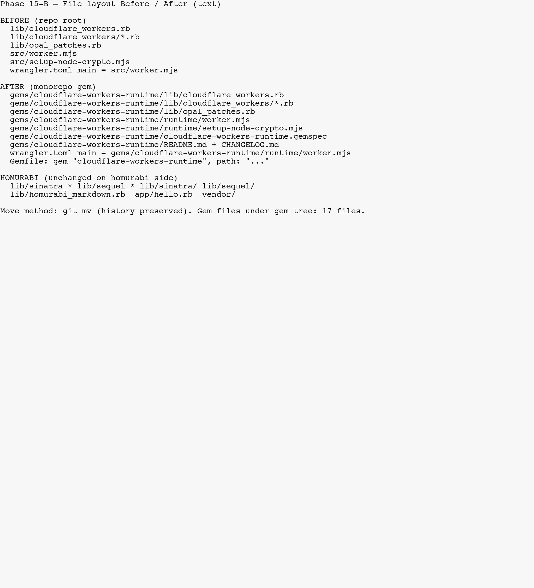
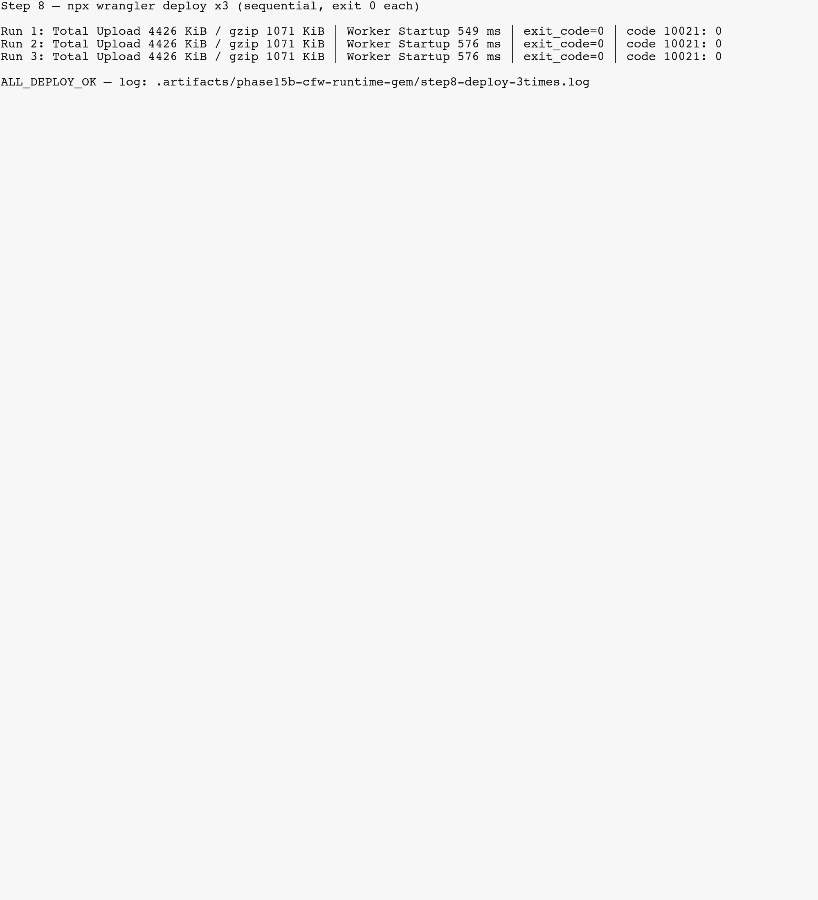

# phase15b-cfw-runtime-gem / Phase 15-B

Created: 2026-04-20  
Branch: `feature/phase15b-cfw-runtime-gem`  
Status: Awaiting Review

## ⏱ 定量メトリクス

| 指標 | 値 | メモ |
|------|-----|------|
| `mise exec -- npm test` wall-time | **~19.1s** (`/usr/bin/time -p` の `real`) | 16 連鎖スイート完走 |
| `mise exec -- npm run build` wall-time | **~4–12s** 程度（キャッシュ依存） | Opal + ERB + assets |
| `wrangler deploy` ×3 | いずれも **exit 0** | `code: 10021` **0 件**（ログ全文 grep 済み） |
| 各 deploy Total Upload | **~4426 KiB** / gzip **~1071 KiB** | 3 回とも同規模 |
| Worker Startup Time | **549–576 ms** | deploy ログより |
| `gems/cloudflare-workers-runtime/` ファイル数 | **17** | `/usr/bin/find … -type f` |
| 本番スモーク | `GET https://homurabi.kazu-san.workers.dev/posts` → **200** | Step 8 live verify |

**実行環境**: ローカル検証は `mise trust` 後の `mise exec --` 経由（`Gemfile.lock` の Bundler 2.6.9 / Ruby 3.4.9）。素の `npm test` はシステム Ruby 2.6 の `bundle` に当たるため **非推奨**。

---

## DoD（B1–B7）達成状況

| ID | 内容 | 状態 |
|----|------|------|
| B1 | `gems/cloudflare-workers-runtime/` に gemspec / Ruby ランタイム / `runtime/worker.mjs` / README+CHANGELOG / example | ✅ |
| B2 | `Gemfile` に `path:` 依存追加、`bundle install` 解決 | ✅ |
| B3 | 旧 `lib/cloudflare_workers*` `lib/opal_patches.rb` `src/worker.mjs` `src/setup-node-crypto.mjs` はリポジトリルートから除去（gem 側へ git mv） | ✅ |
| B4 | `wrangler.toml` の `main` が gem 内 `worker.mjs` を指す | ✅ |
| B5 | Opal `-I gems/cloudflare-workers-runtime/lib`（`Rakefile` / `package.json`） | ✅ |
| B6 | `npm test` 16/16、`wrangler dev` スモーク、`deploy` 連続 3 回 | ✅ |
| B7 | gem README に API / JS contract / Sinatra 誘導 / Quick Start | ✅ |

---

## 実装サマリー

- **monorepo 内 gem** `gems/cloudflare-workers-runtime/` を新設し、Cloudflare Workers 向け Opal ランタイム（`Cloudflare::*` ラッパ、`opal_patches`、`runtime/worker.mjs` 等）を **`git mv` で履歴温存**しつつ集約した。
- **homurabi 本体**は `Gemfile` の `path:` 依存、`wrangler.toml` の `main` 更新、`package.json` / `Rakefile` の Opal `-I` 追加で gem を参照。
- **触っていないもの**: `vendor/`、`app/hello.rb`、`lib/sinatra_*` / `lib/sequel_*` / `lib/sinatra/` / `lib/sequel/` / `lib/homurabi_markdown.rb`（homurabi 側に残置）。
- **ローカル `wrangler dev`**: 初回は D1 に `users` テーブルが無く `/` が 500 になるため、**`npm run d1:init`（`bin/schema.sql`）実行後**にスモーク実施（Step 8 手順として記録）。

---

## 変更ファイル一覧（要点）

| 種別 | パス |
|------|------|
| 新規 gem | `gems/cloudflare-workers-runtime/**/*`（gemspec, README, CHANGELOG, `lib/**`, `runtime/**`, `version.rb`, `wrangler.toml.example`） |
| 配線 | `Gemfile`, `Gemfile.lock`, `Rakefile`, `package.json`, `wrangler.toml`, `docs/TOOLCHAIN_CONTRACT.md` |
| 除去（ルート） | `lib/cloudflare_workers.rb`, `lib/cloudflare_workers/*.rb`, `lib/opal_patches.rb`, `src/worker.mjs`, `src/setup-node-crypto.mjs`（gem へ移動） |

---

## エビデンス（画像・ログ）

| 構成（Before/After テキスト表） | deploy 3 連続 | wrangler dev smoke 要約 |
|--------|--------|--------|
|  |  |  |

| ログファイル | 内容 |
|--------------|------|
| [final-npm-test.log](./final-npm-test.log) | `npm test` 全出力 |
| [step8-smoke-results.txt](./step8-smoke-results.txt) | `curl` スモーク結果 |
| [step8-deploy-3times.log](./step8-deploy-3times.log) | `wrangler deploy` ×3 |
| [wrangler-dev-8799.log](./wrangler-dev-8799.log) | ローカル dev サーバログ |

---

## レビュー結果

- **Cursor `/reviw-plugin:done`**: 本セッションではスキル直接起動なし。**`git diff main...HEAD --stat` ベースの自己レビュー**で代替（下記）。

```
35 files changed, 2453 insertions(+), 43 deletions(-)
```

（`.artifacts/` の証跡・ログが行数を押し上げている。アプリ本体変更は Gemfile / lock / Rakefile / package.json / wrangler.toml / TOOLCHAIN_CONTRACT と gem ツリーへの移動が中心。）

- **Copilot PR レビュー**: Step 11 完了後に件数・対応コミットを本節へ追記する。

---

## PR 情報

- PR 番号: （Step 11 後に記入）
- URL: （同上）
- Copilot 指摘: 件数・対応コミット（同上）
