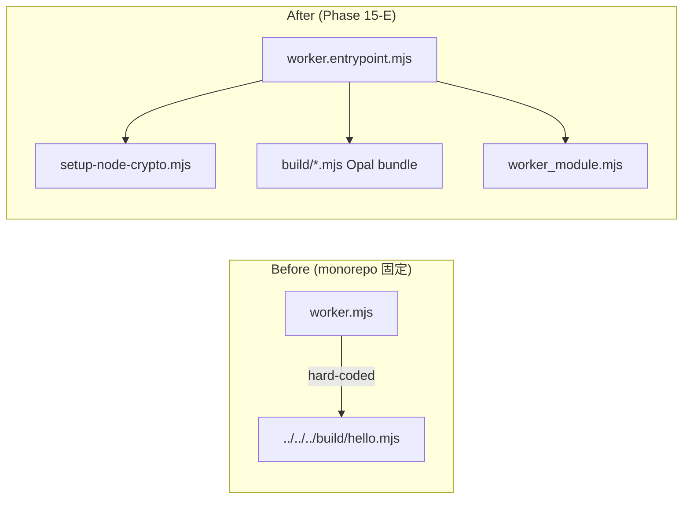

# Cloudflare Workers + Opal — entrypoint topology (Phase 15-E)

## 責務分離（確定）

| レイヤ | 役割 |
|--------|------|
| `wrangler.toml` の `main` | **Workers Module のエントリ**（`fetch` / `scheduled` / `queue` / DO クラスを export） |
| `worker.entrypoint.mjs`（生成物） | `setup-node-crypto` → **Opal bundle（副作用）** → `worker_module.mjs` の順で import。パスはプロジェクトごとに **固定文字列**（codegen） |
| Opal bundle（例: `build/hello.no-exit.mjs`） | **ビルド成果物**。Rack ディスパッチャ等を `globalThis` に登録 |
| `worker_module.mjs`（gem 同梱） | Rack / Cron / Queue / DO への **純粋な JS アダプタ**（Opal bundle を import しない） |

## 禁止事項

- **ランタイム可変 path import**（例: `import(pathVar)` で Opal bundle を読む）は採用しない。Workers のバンドル解決と並行性の両方で破綻しやすい。

## Before / After（概念）

## homurabi 本体

- `wrangler.toml` の `main` は `build/worker.entrypoint.mjs`。
- `bundle exec cloudflare-workers-build` が ERB / assets / Opal / patch / entrypoint 生成まで一括実行。

## スキャフォールド済みアプリ

- プロジェクト直下に `worker.entrypoint.mjs`（`main` と一致）。
- `cf-runtime/` に `setup-node-crypto.mjs` と `worker_module.mjs` をコピー（gem から）。
- `bundle exec cloudflare-workers-build --standalone` が consumer 向けパイプラインを実行し、`Gemfile` の `path:` から homurabi の `vendor/` を追加ロードパスへ取り込み（digest / zlib 等の Workers 向け補助ファイル）。

## Phase 17 — Email Service（`SEND_EMAIL`）

| 項目 | 内容 |
|------|------|
| Wrangler | `[[send_email]]` に `name = "SEND_EMAIL"`（Cloudflare Email Service · Agents Week 2026）。 |
| Rack env | `env['cloudflare.SEND_EMAIL']` は `Cloudflare::Email`（JS `env.SEND_EMAIL.send(...)` を Ruby 側で `await`）。 |
| 備考 | consumer アプリ側で verified sender を wrangler `[vars]` などに載せ、アプリから `from` に渡す。 |

## wrangler.json について

- **生成・サポート対象は `wrangler.toml` のみ**。`wrangler.json` / `wrangler.jsonc` は手動変換可だが、本ツールチェーンの前提外。
